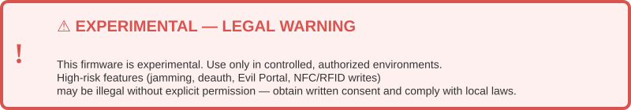

---
**Ouroboros Mini (OuroMini)** is an **ESP32-based experimental wireless monitoring and security testing platform**. Engineered under a **15-day rapid prototype cycle**, it combines **dual-use capabilities** — both **defensive monitoring** and **controlled offensive research** — for educational, research, and expo demonstration purposes.  

---

## 🔬 Project Objective

1. Deliver a **compact cross-protocol wireless research platform**: Wi-Fi, BLE, Sub-GHz, IR, RFID/NFC, NRF24, and FM.
2. Provide **real-time visualization** on **OLED display** and optional **LED array indicators**.
3. Enable **signal capture, replay, and controlled jamming** for research and teaching.
4. Demonstrate **wireless anomaly detection, telemetry visualization, and interactive dashboards** in expos and labs.
5. Serve as a **modular research artifact**, showcasing integration between hardware, firmware, and visual analytics.

---

## ⚠️ Dual-Use & Legal Considerations

> Warning: OuroMini is intended solely for educational, research, and ethical security testing purposes. Unauthorized use on networks or devices you do not own or have explicit permission to test is illegal and strictly prohibited. Users must comply with local wireless regulations (FCC, CE, ISM bands) and follow responsible disclosure practices. The developers are not liable for misuse or unlawful activities. Always operate safely, ethically, and within the law.

---

## ⚙️ Full Feature Set

| Protocol Layer | Features | Notes |
|---|---|---|
| **Sub‑GHz (CC1101)** | - Signal reading & emulation (capture & replay complex remotes)<br>- Spectrum analyzer with graphical visualization<br>- Signal jamming: full/intermittent PWM waveforms<br>- Organized signal storage, replay profiles | CC1101 support for Flipper Zero, LilyGO CC1101, ESP32, M5 devices. Demo/research only; comply with RF regulations. |
| **Wi‑Fi (2.4 / 5 GHz)** | - Network scanning, device enumeration, RSSI mapping<br>- Deauth & flood attacks (including 5GHz via RTL8720DN)<br>- Beacon spam, Evil Portal, WPS attacks<br>- Packet sniffing, deep packet inspection, advanced traffic analysis<br>- Wardriving, host scanning, WireGuard tunneling<br>- Pwnagotchi & Brucegotchi integration | Hardware-dependent (ESP32, RTL8720DN, SDR). Demo & pen-test research; not persistent defense. |
| **Bluetooth (BLE)** | - Advertising monitoring & RSSI mapping<br>- BLE spoofing/emulation (device cloning)<br>- BLE spam (iOS, Android, Windows)<br>- BLE beacon creation & manipulation<br>- Packet interception, BLE keyboard (Cardputer/T-Deck) | Platform-dependent. Focus on research, robustness testing, and educational demos. |
| **RFID / NFC** | - Scan, save, clone, and emulate 125 kHz/HF NDEF tags<br>- Write/erase tags, Amiibo/Chameleon workflows<br>- Tag emulation for access control testing | PN532 & compatible modules. Auditing & lab testing only. |
| **Infrared (IR)** | - Capture & send IR signals (NEC, SIRC, RC5, Samsung, custom sequences)<br>- TV-B-Gone mode for demo<br>- IR database with thousands of remotes | Visual demonstration focus; low legal risk but caution in public areas. |
| **NRF24L01+ / 2.4GHz ISM** | - 2.4GHz communication testing, packet capture & analysis<br>- Mesh network simulation & packet inspection<br>- NRF24 jamming & MouseJack-style demos | Requires NRF24 module; highlights IoT/mesh network security tradeoffs. |
| **FM (optional)** | - Spectrum scan, broadcast control, hijack traffic announcements (demo) | Use only reserved/demo channels. Dependent on regional regulations. |
| **On-Device Display (OLED)** | - Waterfall & spectrum graphs, ghost traces (fading signal history)<br>- Target/device lists, real-time metrics<br>- Brightness, orientation, color accents, boot sound control | Optimized for OLED; high visual impact demos. |
| **Data Storage & Filesystems** | - SD/LittleFS logging: configs, captured signals, IR/RF/RFID files, images, scripts<br>- SD Card & SPIFFS manager, image viewers, BADUSB storage integration | Persistent demo logs; export for offline analysis. |
| **USB / Scripts / BADUSB** | - USB keyboard scripting, JavaScript interpreter, OpenHaystack, iButton, QR Codes, PIX, WebUI support<br>- ESP-NOW send/receive files & commands | Only for demonstration; responsible use mandatory. |
| **Connectivity & Services** | - Wi-Fi client/AP, WireGuard, Telnet/SSH, TCP client/listener, Web server & WebUI, Wigle upload | Remote telemetry & demo control; sandbox for safety. |
| **Config / UI / Misc** | - Configurable UI, boot text, RTC/NTP clock, brightness/dim, sleep/restart<br>- Orientation, UI color, LED control | Polished UX; highlights rapid prototyping design. |
| **Design Intention** | High visual impact, interactive demonstration with cross-device compatibility (Flipper, LilyGO CC1101, ESP32, M5). | Not for continuous network defense; controlled dual-use only. |

---
## OuroMini Feature Classification: Defensive, Dual‑Use, and Offensive Capabilities

| Category               | Count | Example Features / Notes                                                                                                                                                                                                                                         |
| ---------------------- | ----- | ----------------------------------------------------------------------------------------------------------------------------------------------------------------------------------------------------------------------------------------------------------------- |
| **Defensive**          | 28    | Passive monitoring and analysis-focused capabilities: <br>- Wi-Fi scanning, device enumeration, RSSI mapping<br>- BLE presence detection, advertising monitoring<br>- Sub-GHz spectrum analysis (RX only)<br>- Packet sniffing, deep packet inspection<br>- SD/LittleFS logging and file management<br>- OLED visualization (waterfall, ghost traces, metrics)<br>- Dashboard telemetry display<br>- Configurable UI, brightness, orientation, color accents, boot sound control<br>- Safe IR/NRF/Frequency observation<br>- NFC/RFID read-only scanning<br>- ESP-NOW receive-only monitoring<br>- FM spectrum scan (RX only)<br>**Notes:** Fully passive; no signal disruption or attacks. Suitable for monitoring, research, and demo analytics. |
| **Neutral / Dual‑Use** | 14    | Features that can be either passive or active depending on configuration: <br>- Sub-GHz signal replay (TX off by default)<br>- NRF24 mesh simulation (passive capture vs. active packet injection)<br>- BLE emulation or beaconing (default passive)<br>- IR replay sequences (demo mode vs. active control)<br>- USB/BADUSB scripting (local testing only)<br>- ESP-NOW send/receive (demo vs. actual control)<br>- Some dashboard/web controls can trigger active modules but default read-only<br>**Notes:** Requires careful configuration to remain safe; can be used in controlled dual-use scenarios. |
| **Offensive**          | 18    | Active attack or disruption features: <br>- Wi-Fi deauthentication (2.4/5 GHz)<br>- Deauth flood targeting multiple devices<br>- Wi-Fi beacon spam / fake AP floods<br>- Evil Portal (phishing demo page)<br>- WPS attacks<br>- BLE injection/spam across OS platforms<br>- BLE keyboard injection (Cardputer/T-Deck)<br>- NFC/RFID cloning & write/emulation<br>- IR signal replay affecting other devices<br>- Sub-GHz jamming (full/intermittent PWM)<br>- NRF24 jamming / MouseJack testing<br>- BADUSB actuation affecting connected systems<br>**Notes:** Only to be used in controlled lab/demo environments; illegal if used without permission. |

---

## 🛠️ Hardware Architecture

- **MCU:** ESP32-S3-WROOM-1 (central processing & wireless control)  
- **Power Management:** TP4056 Li-ion charging, LDO voltage regulators  
- **Visual:** OLED 0.96-1.3” + WS2812 LED array  
- **Storage:** SD Card & LittleFS  
- **Inputs:** Buttons, tactile switches, slide switches, buzzer  
- **Peripheral Modules:** Optional Sub-GHz transceivers, NRF24, IR, CC1101  

> Designed as a **mainboard-only experimental platform** for rapid prototyping; optional modules extend dual-use research capabilities.

---

## 💻 Firmware Overview

- **Framework:** Arduino-ESP32 for fast deployment  
- **Structure:**
```
firmware/
├── src/       # main.ino, config.h
├── libs/      # drivers: Wi-Fi, BLE, Sub-GHz, IR, NFC, NRF24
├── modules/   # offensive/defensive dual-use feature toggles
└── binaries/  # precompiled .bin for rapid flashing
```
- **Core functionality:** Wi-Fi/BLE scanning, anomaly detection, signal capture/replay, SD logging, OLED visualization, minimal WebUI dashboard  
- **Upload:** Arduino IDE or Espressif Flash Download Tool  
- Modular design allows safe **feature toggling** to disable high-risk modules during demos

---

## 🌐 Web Dashboard (Expo-Focused)

- Minimalist dashboard to visualize telemetry:  
  - Device presence (Wi-Fi/BLE)  
  - Signal strength graphs (RSSI)  
  - Detection flags & alert logs  
  - Device status & uptime metrics  

```
dashboard/
├── webapp/    # index.html, dashboard.js, style.css
├── api/       # Python/Flask endpoint for telemetry
└── design/    # Figma/static visual prototypes
```

> Dashboard optimized for **high visibility in expo/lab demos**, not production analytics.

---

## 📄 Documentation

- `docs/Abstract.md` — Overview & research rationale  
- `docs/Architecture.md` — Full hardware/software mapping  
- `docs/Firmware_Flow.md` — Module descriptions & compile flags  
- `docs/Expo_Presentation.md` — Demo instructions & safety scripts  
- `docs/Dashboard_Design.md` — Data visualization & UI layout 
- [`Expo-PPT`](https://stool-vast-77297611.figma.site/) - Expo Presentation

---

## 🔧 Safety & Operational Guidelines

- **Dual-Use:** Compile-time feature flags separate offensive/defensive modules  
- **Lab Isolation:** Use Faraday cages or dedicated RF testing environments  
- **Permission:** Obtain explicit consent before running offensive functions  
- **High-Risk Modules:** Segregate jamming, Evil Portal, BLE spoofing scripts  
- **Demonstration:** Keep visualizations and dashboard active to highlight research/education value.

---

## Team OuroMini


---

## 📜 License

**Project Ouroboros** © 2025 **MARS Foundation**  
Licensed under **GNU AGPL-3.0** – use, modify, and redistribute under AGPL terms. See [LICENSE](LICENSE).

---
